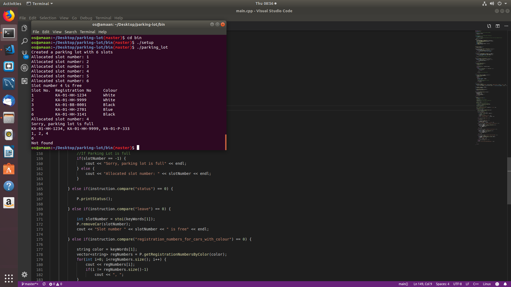

# parking-lot
This is an OOP implementation of a real life parking lot with edge case handling.

Please feel free to create Issues if you find a bug somewhere or send a Pull Request if you wish to improve the existing code/add a new feature. :)

## Setup

Clone the project locally.

```sh
$ git clone https://github.com/amaaniqbal/parking-lot.git
```

Change directory to folder parking_lot

```sh
$ cd parking_lot
```

## Usage

Execute the following instruction one by one to run the code.

```sh
# Change directory to a folder bin where UNIX executable are stored
$ cd bin
```

```sh
# Compile the Source Code using the following instruction. 
# Before running this make sure you have all the requirements installed.
$ ./setup
```

```sh
# Finally Run the project by executing the below instruction. 
# This takes the file stored in `functional_spec/fixtures` as input by default. 
# You can also remove the file name and use the command prompt only for interactive workflow. 
$ ./parking_lot
```

```sh
# For using the command prompt only, its better to run the following command
$ ./main
```

## Requirements

```sh
g++ 7.3.0 
```

## Sample Output Window


